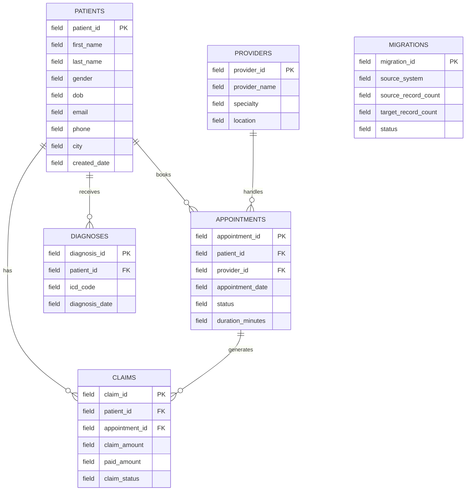

# Healthcare Management System - ER Diagram

```mermaid

erDiagram
    PATIENTS {
        field patient_id PK
        field first_name
        field last_name
        field gender
        field dob
        field email
        field phone
        field city
        field created_date
    }

    APPOINTMENTS {
        field appointment_id PK
        field patient_id FK
        field provider_id FK
        field appointment_date
        field status
        field duration_minutes
    }

    PROVIDERS {
        field provider_id PK
        field provider_name
        field specialty
        field location
    }

    CLAIMS {
        field claim_id PK
        field patient_id FK
        field appointment_id FK
        field claim_amount
        field paid_amount
        field claim_status
    }

    DIAGNOSES {
        field diagnosis_id PK
        field patient_id FK
        field icd_code
        field diagnosis_date
    }

    MIGRATIONS {
        field migration_id PK
        field source_system
        field source_record_count
        field target_record_count
        field status
    }

    PATIENTS ||--o{ APPOINTMENTS : books
    PROVIDERS ||--o{ APPOINTMENTS : handles
    PATIENTS ||--o{ CLAIMS : has
    APPOINTMENTS ||--o{ CLAIMS : generates
    PATIENTS ||--o{ DIAGNOSES : receives

```